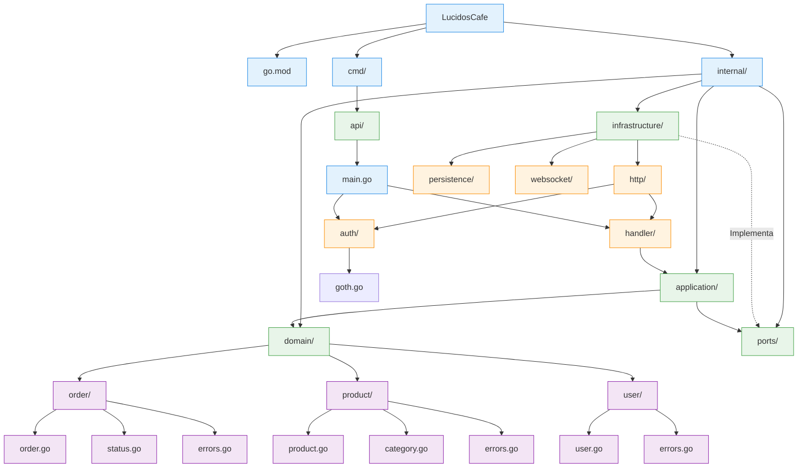

```mermaid
flowchart TD
    root["LucidosCafe"]
    root --> go["go.mod"]
    root --> cmd["cmd/"]
    root --> internal["internal/"]

    cmd --> api["api/"]
    api --> main["main.go"]

    internal --> app["application/"]
    internal --> domain["domain/"]
    internal --> ports["ports/"]
    internal --> infrastructure["infrastructure/"]

    infrastructure --> http["http/"]
    infrastructure --> persistence["persistence/"]
    infrastructure --> websocket["websocket/"]

    http --> authFolder["auth/"]
    authFolder --> goth["goth.go"]
    http --> handlerFolder["handler/"]

    domain --> order["order/"]
    order --> orderGo["order.go"]
    order --> orderStatus["status.go"]
    order --> orderErr["errors.go"]

    domain --> product["product/"]
    product --> productGo["product.go"]
    product --> categoryGo["category.go"]
    product --> productErr["errors.go"]

    domain --> user["user/"]
    user --> userGo["user.go"]
    user --> userErr["errors.go"]

    %% Flujo de Inyección de Dependencias
    main --> authFolder
    main --> handlerFolder
    handlerFolder --> app
    app --> domain
    infrastructure -. Implementa .-> ports
    app --> ports

    classDef entry fill:#e3f2fd,stroke:#1e88e5,stroke-width:1px;
    classDef layer fill:#e8f5e9,stroke:#43a047,stroke-width:1px;
    classDef infra fill:#fff3e0,stroke:#fb8c00,stroke-width:1px;
    classDef domain fill:#f3e5f5,stroke:#8e24aa,stroke-width:1px;

    class root,main,go,cmd,internal entry;
    class api,app,domain,ports,infrastructure layer;
    class http,persistence,websocket,authFolder,handlerFolder infra;
    class order,product,user,orderGo,orderStatus,orderErr,productGo,categoryGo,productErr,userGo,userErr domain;
```